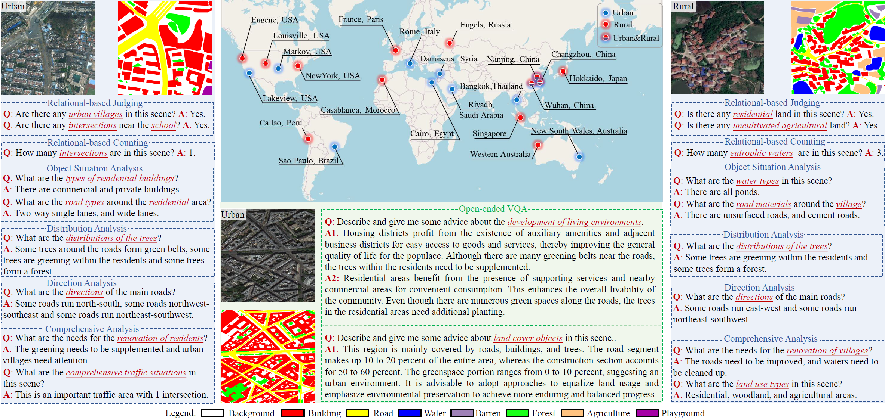

<h2 align="center">EarthVL: A Progressive Earth Vision-Language Understanding and Generation Framework</h2>

<h5 align="right">by <a href="https://junjue-wang.github.io/homepage/">Junjue Wang</a>,
<a href="http://rsidea.whu.edu.cn/">Yanfei Zhong</a>,
Zihang Chen,
<a href="http://zhuozheng.top/">Zhuo Zheng</a>, 
 Ailong Ma, and <a href="http://www.lmars.whu.edu.cn/prof_web/zhangliangpei/rs/index.html">Liangpei Zhang</a></h5>


<div align="center">
  
</div>

## News
- 2026/01/06, We are preparing the code and data for EarthVL.
- 2024/09/25, EarthVL is the extension of our EarthVQA and LoveDA projects.


#### Requirements:
- pytorch >= 1.1.0
- python >=3.6


### Install Ever + Segmentation Models PyTorch
```bash
pip install ever-beta
pip install git+https://github.com/qubvel/segmentation_models.pytorch
```
### Preparation
- Download Pre-trained vicuna-7B from hugging face: https://huggingface.co/lmsys/vicuna-7b-v1.5
- Unzip the data 

### Test

```bash
sh ./scripts/test.sh
```
### Train
```bash
sh ./scripts/train_generation.sh
```

## Citation
If you use EarthVQA in your research, please cite our following papers.
```text
    @article{wang2024earthvqa, 
        title={EarthVQA: Towards Queryable Earth via Relational Reasoning-Based Remote Sensing Visual Question Answering},
        url={https://ojs.aaai.org/index.php/AAAI/article/view/28357}, 
        DOI={10.1609/ai.v38i6.28357}, 
        author={Junjue Wang and Zhuo Zheng and Zihang Chen and Ailong Ai and Yanfei Zhong}, 
        year={2024}, 
        month={Mar.},
        volume={38},
        pages={5481-5489}}
    @proceedings{wang2021loveda,
         author = {Wang, Junjue and Zheng, Zhuo and Ma, Ailong and Lu, Xiaoyan and Zhong, Yanfei},
         booktitle = {Proceedings of the Neural Information Processing Systems Track on Datasets and Benchmarks},
         editor = {J. Vanschoren and S. Yeung},
         pages = {},
         publisher = {Curran Associates, Inc.},
         title = {LoveDA: A Remote Sensing Land-Cover Dataset for Domain Adaptive Semantic Segmentation},
         url = {https://datasets-benchmarks-proceedings.neurips.cc/paper_files/paper/2021/file/4e732ced3463d06de0ca9a15b6153677-Paper-round2.pdf},
         volume = {1},
         year = {2021}
    }
```


